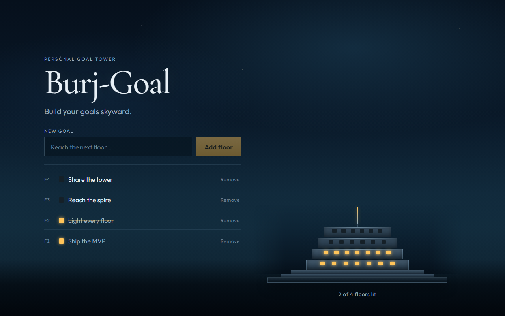

# Burj-Goal



Burj-Goal is a lightweight browser app for turning personal goals into a visual tower of floors. Each goal becomes a floor, and completing a goal lights the windows so the tower feels progressively more complete.

## What the app does

- Add goals from a single input field.
- Toggle goals between open and done states.
- Delete goals and keep the remaining floors ordered consistently.
- Persist goals in the browser with localStorage so the tower survives refreshes.

## Tech stack

- Next.js (App Router) + TypeScript + React
- Client-only persistence via localStorage using the `burj-goal:v1` key
- Playwright end-to-end coverage for the core user journeys

## Architecture at a glance

The app is intentionally small and compositional:

- [components/GoalApp.tsx](components/GoalApp.tsx) composes the page shell and wires the task state into the UI.
- [components/TaskForm.tsx](components/TaskForm.tsx) handles goal creation.
- [components/TaskList.tsx](components/TaskList.tsx) renders the goal list with toggle and delete actions.
- [components/Tower.tsx](components/Tower.tsx) and [components/Floor.tsx](components/Floor.tsx) render the visual tower.
- [lib/useTasks.ts](lib/useTasks.ts) and [lib/storage.ts](lib/storage.ts) manage state updates and persistence.

A more detailed component walkthrough lives in [docs/architecture.md](docs/architecture.md).

## Local development

```bash
npm install
npm run dev
```

Open http://localhost:3000. Use `npm run dev` for manual exploration only — Playwright e2e does not target that server.

For a production-style smoke test:

```bash
npm run build
npm start
```

## Testing

Playwright end-to-end tests live under [tests](tests). The suite covers empty state, adding goals, toggling completion, deletion, persistence, and cross-tab synchronization.

Run the suite locally with:

```bash
npm run test:e2e
```

That command builds the app and starts a dedicated production server on port **3001** (`reuseExistingServer: false`), so a local `npm run dev` on :3000 cannot be reused by mistake.

Additional helpers:

```bash
npm run test:e2e:ui
npm run test:e2e:headed
```

See [tests/README.md](tests/README.md) for the test layout, selectors, and isolation strategy.

## Documentation

- [docs/architecture.md](docs/architecture.md) for a component-by-component overview
- [tests/README.md](tests/README.md) for Playwright conventions and commands
- [tests/e2e/goals.spec.ts](tests/e2e/goals.spec.ts) for the main user-flow coverage

## Deploy to Vercel

1. Push this repo to GitHub (or deploy from the Vercel CLI).
2. In Vercel, choose Add New Project and import the repo.
3. Framework preset: Next.js. Leave environment variables empty.
4. Click Deploy. You will receive a free *.vercel.app URL.
5. Optional custom domain: Project → Settings → Domains → add your domain and follow the DNS instructions.

No environment variables are required for the MVP.

### Vercel CLI

```bash
npm i -g vercel
vercel
```

## Notes

- Each browser and device has its own tower. Clearing site data resets goals.
- Tasks never leave your machine; Vercel only hosts the static app shell.
